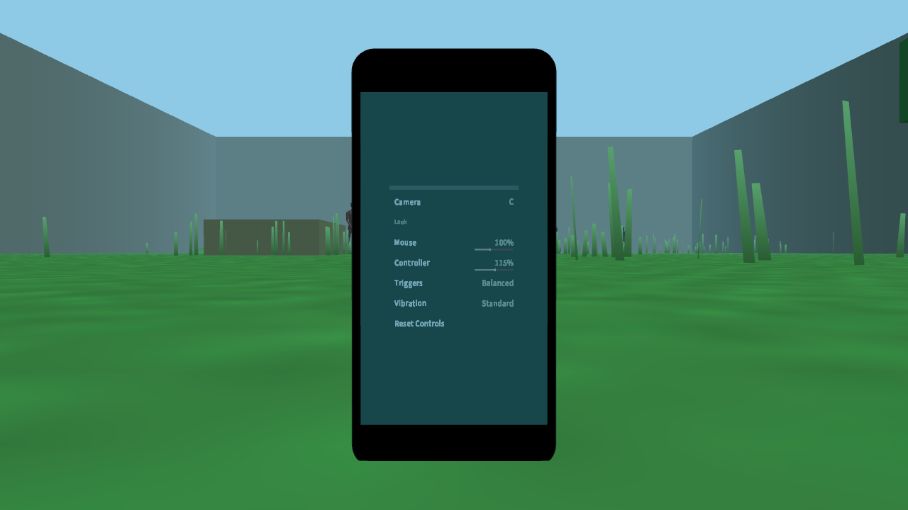
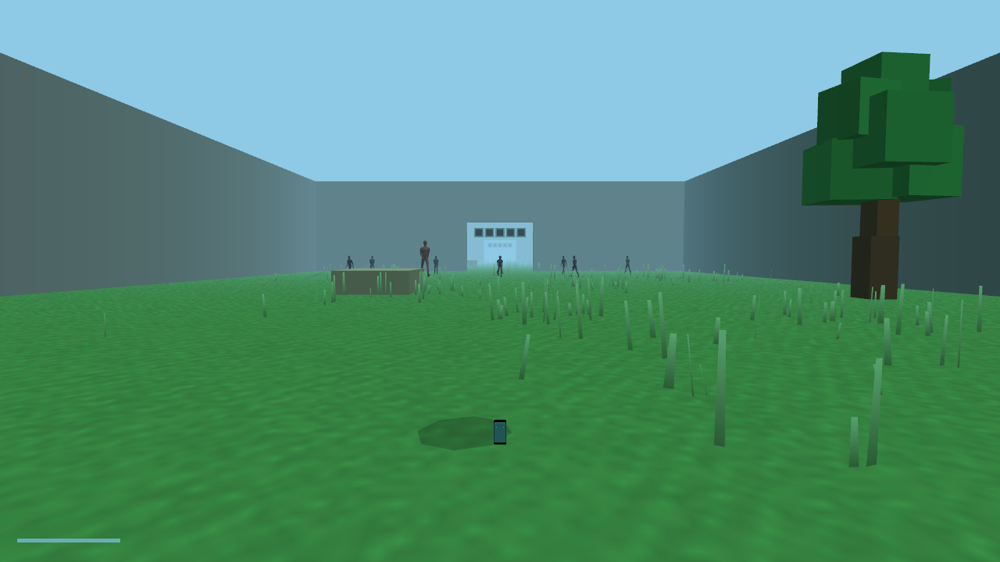

# Preference correction evidence

This slice applies the first decisions from the October 3 player preference
passes. It corrects hierarchy and control regressions before adding larger
title, inspection, upgrade, residue, or death sequences.

## Applied decisions

- Ordinary submenu content carries its own identity; redundant page titles are
  absent.
- Routine menu help is absent. Key rebinding alone displays `PRESS A KEY` while
  it owns input.
- Back is an edge action (`Escape`, controller back, or pointer back), not a
  selectable content row.
- Ordinary phone lists wrap. The two-choice death decision remains bounded.
- Battery remains available as a minimal reflex-critical HUD bar. Objective
  progress appears contextually after progress begins or the path opens.
- Enemy head glyphs are absent at rest and reinforce only an attack or recent
  impact.

## Captures

## Verification

- Release build completed.
- Assertion-bearing Debug phone display, menu layout, and navigation tests
  passed. This also corrected stale expectations that Release builds had hidden.
- Complete CTest suite passed: 47/47.
