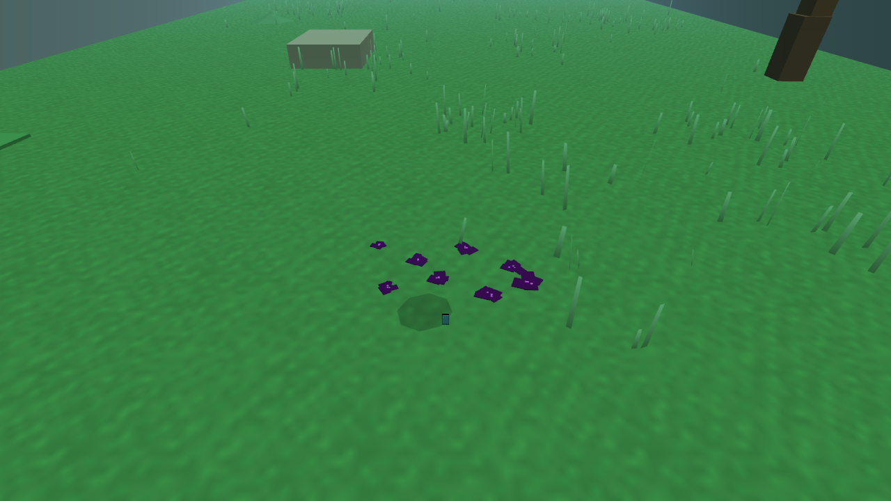

# Visual cohesion Phase D evidence

Enemy ingestion now leaves a temporary, mechanically meaningful trace in the world.

## Integrated behavior

- The established 14-point capture reward remains the total authority.
- Ingestion grants 10 points immediately.
- Eight residue fragments retain the remaining 4 points.
- Fragments splash from the ingestion location, settle on the floor, and remain for ten seconds.
- Holding the vacuum within range pulls settled fragments back into the phone for 0.5 charge each.
- A full battery leaves residue in the world instead of silently consuming it.

The first deterministic render produced identical bright plus signs. That presentation was rejected as pickup-like and visually tacked on. The retained implementation uses irregular overlapping dark lobes with small embedded signal fragments.

## Verification

- `SignalResidueLifecycleTest` verifies the unchanged 14-point total, eight-fragment spawn, deliberate vacuum recovery, and complete fragment consumption.
- `DeterministicInputSoak` passes with residue in the authoritative particle lifecycle.
- complete Release CTest suite: 47/47 passed.
